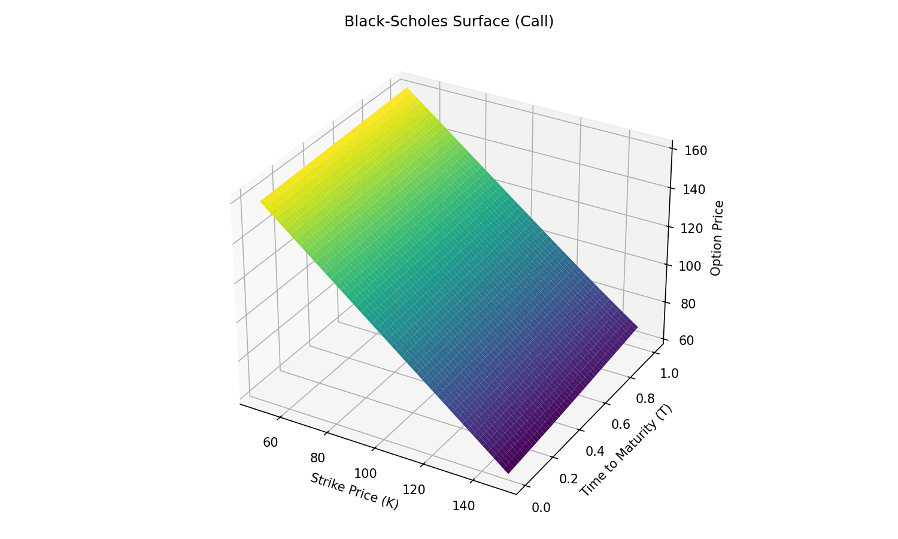

# Options Pricer

A Python project to fetch live options data, compute theoretical prices using Black-Scholes and Binomial Tree models, and compare them to market quotes. Includes volatility estimation and visualization of pricing surfaces.

## Features

* **Black-Scholes Model** for European options
* **Binomial Tree Model** for American options (supports early exercise)
* **Historical Volatility** estimation from recent price data
* **Live Data** fetch via Yahoo Finance (`yfinance`)
* **3D Visualization** of Black-Scholes pricing surface

## Project Structure

```
options_pricer/
├── data/                      # (optional) saved market data
├── models/                    # Pricing model implementations
│   ├── black_scholes.py
│   └── binomial_tree.py
├── utils/                     # Data fetchers and helpers
│   ├── fetch_data.py
│   └── __init__.py
├── viz/                       # Visualization scripts and assets
│   ├── bs_surface_plot.py
│   ├── bs_surface.png         # Generated pricing surface image
│   └── __init__.py
├── main.py                    # Entry point for pricing comparison
├── README.md                  # This file
└── requirements.txt           # Dependencies
```

## Installation

1. Clone the repository:

   ```bash
   git clone https://github.com/<your-username>/options_pricer.git
   cd options_pricer
   ```
2. Create and activate a virtual environment:

   ```bash
   python -m venv venv
   source venv/bin/activate      # macOS/Linux
   venv\Scripts\activate       # Windows
   ```
3. Install dependencies:

   ```bash
   pip install -r requirements.txt
   ```

## Usage

### Run the pricer

```bash
python main.py --ticker AAPL --option_type call --num_options 10
```

### Visualize Black-Scholes Surface

```bash
python -m viz.bs_surface_plot
```

## Sample Output

```bash
AAPL — CALL OPTIONS — Expiry: 2025-08-01
  Strike |   Market |      B-S |  BinTree
----------------------------------------
  110.00 |   102.07 |    98.55 |    98.55
  ...
```



**Figure 1:** Black-Scholes call pricing surface for AAPL
Parameters: \$S=209.35\$, \$r=5%\$, \$\sigma\approx27%\$

